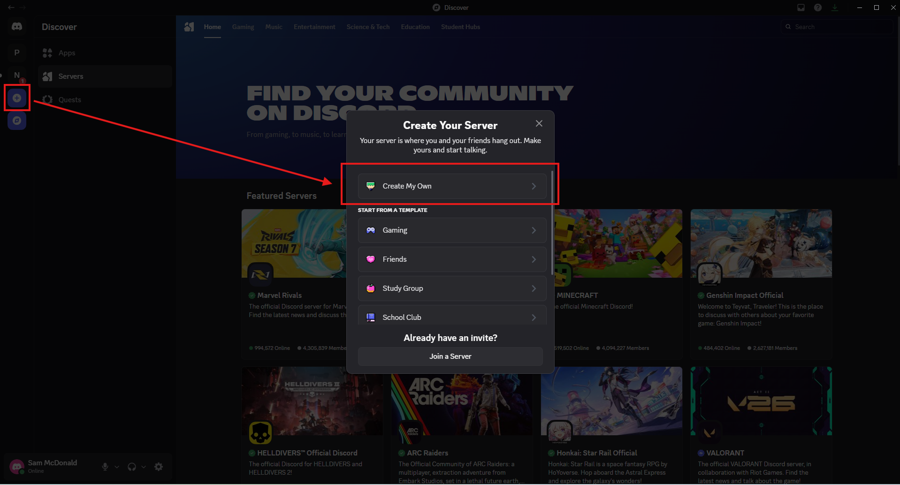
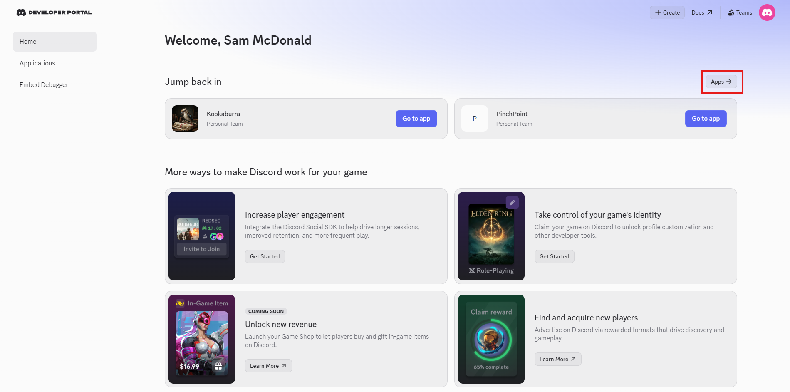
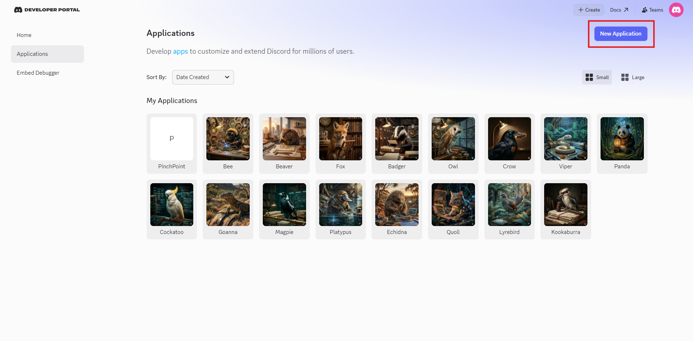
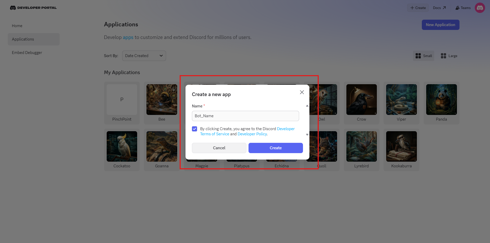
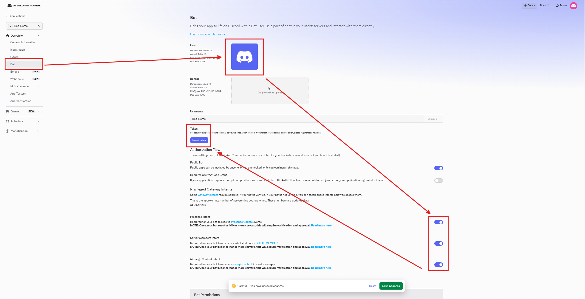
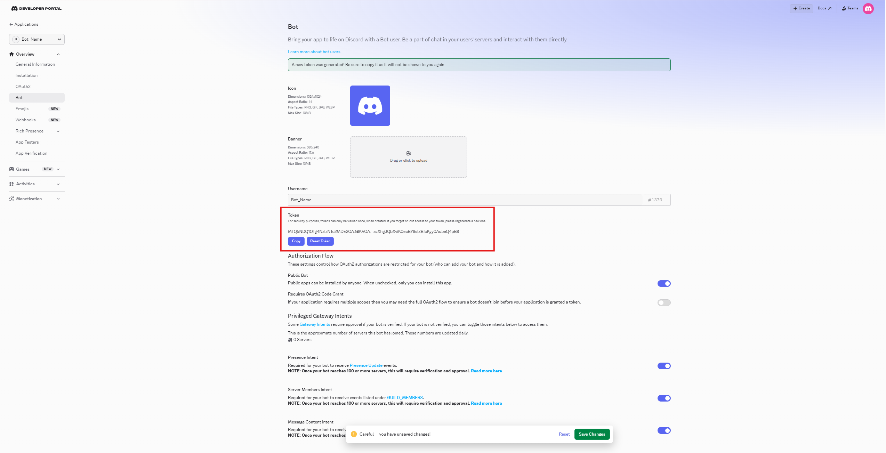
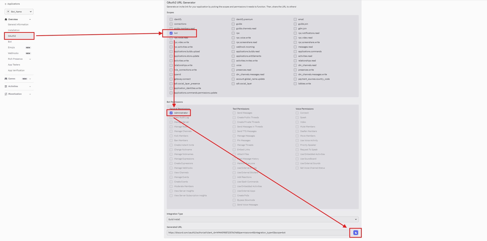
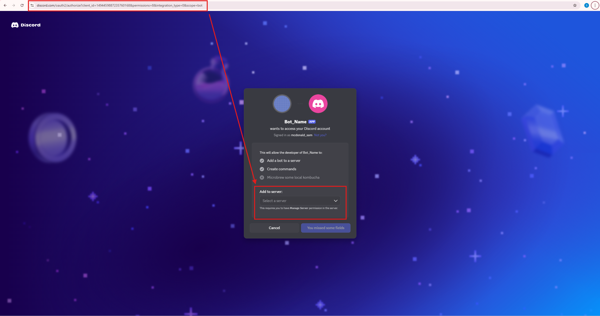

# PinchCord

Orchestrate a team of AI agents through Discord — shared channels, inter-bot communication, and fleet management. Supports both **Claude Code** and **OpenAI Codex** bots.

PinchCord is an MCP server + Claude Code plugin that connects AI sessions to Discord. Run one bot or an entire fleet. Bots can talk to each other, respond to commands, manage threads, and coordinate work — all through a shared Discord channel.

PinchCord is part of the **PinchPoint** suite. This repo also ships skills for Point (knowledge API) and Pinch (scheduling) as they mature.

## How it works

### Claude bots

```
You (Discord)
    | messages
Discord Server
    +-- #hub channel      (all bots see everything)
    +-- Bot DMs           (private per-bot)
         | WebSocket (discord.js)
PinchCord MCP Server (one per bot)
    | stdio
Claude Code (bot session)
```

Each bot is a Claude Code process with PinchCord loaded as an MCP server. A Discord bot token determines which bot it authenticates as. A system prompt gives it a role.

### Codex bots

```
You (Discord)
    | messages
Discord Server
    +-- #hub channel
         | WebSocket (discord.js)
Codex Adapter (Node.js)
    | WebSocket (JSON-RPC)
Codex App-Server (persistent) or Codex CLI (exec)
    | MCP
PinchCord MCP Server
    | stdio → Discord API
Discord (replies)
```

Codex bots use a discord.js adapter for inbound messages and PinchCord MCP for outbound replies. Two modes are available:

- **Persistent** — always-on watcher via Codex app-server (WebSocket). Maintains context across messages. Ideal for sentinel/observer bots.
- **Exec** — spawns a fresh Codex process per message. Stateless. Ideal for quick-strike reviewers or on-demand tasks.

## Quick start

### 1. Create Discord bots

One Discord application = one bot. Repeat these steps for every bot in your fleet.

**Step 1 — Create a Discord server for your project**

If you don't already have one, open Discord, click the **+** icon in the server sidebar, and choose **Create My Own**.



**Step 2 — Open the Developer Portal**

Go to the [Discord Developer Portal](https://discord.com/developers/applications) and click **Applications** in the sidebar.



**Step 3 — Create a new application**

Click **New Application** in the top right. Each bot in your fleet needs its own application.



**Step 4 — Name the bot**

Give it a name, accept the Developer Terms of Service, and click **Create**.



**Step 5 — Enable privileged intents**

Open the **Bot** tab. Scroll to **Privileged Gateway Intents** and toggle on all three:

- Presence Intent
- Server Members Intent
- Message Content Intent

Click **Save Changes** at the bottom. You can also upload an icon for the bot here.



**Step 6 — Copy the bot token**

Still on the **Bot** tab, click **Reset Token** then **Copy**. Discord only shows the token once.

Paste it into `.pinchme/cord/bots.json` under the bot's entry:

```json
{
  "MyBot": {
    "token": "PASTE_THE_TOKEN_HERE",
    "workDir": ".",
    "promptFile": ".pinchme/cord/prompts/mybot.md",
    "model": "claude-sonnet-4-6",
    "channelId": "YOUR_HUB_CHANNEL_ID"
  }
}
```



> `.pinchme/cord/bots.json` is gitignored by default so tokens stay out of version control.

**Step 7 — Generate the invite URL**

Open the **OAuth2** tab. Under **Scopes**, check `bot`. Under **Bot Permissions**, check **Administrator** (simplest) — or pick granular permissions: Send Messages, Read Message History, Create Public Threads, Embed Links, Attach Files, Add Reactions, Use Slash Commands. Set Integration Type to **Guild Install**.

Copy the generated URL at the bottom of the page.



**Step 8 — Invite the bot to your server**

Paste the URL into your browser, pick your server from the dropdown, and authorize. The bot now appears in your server's member list (offline until you launch it).



**Step 9 — Repeat for each bot**

Go back to Applications and repeat Steps 3-8 for every bot in your fleet. Each bot gets its own application, its own token, and its own entry in `bots.json`.

### 2. Install PinchCord

```bash
git clone https://github.com/PinchPoint-dev/PinchPoint.git .pinchpoint
cd .pinchpoint
bun install
```

### 3. Configure your bots

Set up your PinchMe directory. This is where your bot config lives — either in your project repo (project-local) or your home directory (global):

```bash
# Option A: Project-local (recommended — config lives with your project)
cp -r .pinchpoint/cord/pinchme-template .pinchme

# Option B: Global (one fleet across all projects)
cp -r .pinchpoint/cord/pinchme-template ~/.pinchme
```

Edit `.pinchme/cord/bots.json` with your bot tokens:

```json
{
  "Engineer": {
    "token": "YOUR_DISCORD_BOT_TOKEN",
    "workDir": ".",
    "promptFile": ".pinchme/cord/prompts/engineer.md",
    "model": "claude-sonnet-4-6",
    "effort": "high",
    "channelId": "YOUR_HUB_CHANNEL_ID"
  }
}
```

> **`channelId` is required.** This is the Discord snowflake ID of your hub channel (e.g., `"1492138400008896604"`). Without it, the bot defaults to PinchPoint's channel ID, causing it to post in the wrong server. Get it by right-clicking the channel in Discord with Developer Mode enabled.

Write a system prompt for each bot in `.pinchme/cord/prompts/`. See `prompts/` in this repo for 9 example templates covering common team roles.

#### Cross-repo bots

A bot's `workDir` can point to a different repo. This is useful when you have specialized bots that work in separate codebases but communicate through the same Discord channel.

```json
{
  "Engineer": {
    "token": "...",
    "workDir": ".",
    "promptFile": ".pinchme/cord/prompts/engineer.md",
    "model": "claude-sonnet-4-6",
    "effort": "high",
    "channelId": "YOUR_HUB_CHANNEL_ID"
  },
  "Scraper": {
    "token": "...",
    "workDir": "/Users/you/Projects/OtherRepo",
    "promptFile": ".pinchme/cord/prompts/scraper.md",
    "model": "claude-sonnet-4-6",
    "effort": "medium",
    "channelId": "YOUR_HUB_CHANNEL_ID"
  }
}
```

When `workDir` points outside the project where PinchCord is installed, the launcher automatically generates an MCP config so the bot can still connect to Discord. No extra setup needed — just set the path and launch.

The `.pinchme/.gitignore` automatically protects `bots.json` (tokens) and `logs/` from being committed. Prompts and mind entries are safe to share. You should also add `.pinchme/` to your project's root `.gitignore` if you don't want any of it committed.

### 4. Launch

**Fleet mode** (multiple bots in terminal tabs/panes):

```bash
# Mac / Linux (tmux)
./.pinchpoint/cord/claude/launch.sh                      # all bots
./.pinchpoint/cord/claude/launch.sh Engineer Reviewer    # specific bots
```

```powershell
# Windows (Windows Terminal)
.\.pinchpoint\cord\claude\launch.ps1                     # all bots
.\.pinchpoint\cord\claude\launch.ps1 Engineer Reviewer   # specific bots
```

The launcher auto-detects your config: checks `.pinchme/cord/bots.json` in the current directory first, then `~/.pinchme/cord/bots.json` as a fallback.

**Single bot** (manual):

```bash
export DISCORD_BOT_TOKEN="your-token"
export PINCHHUB_CHANNEL_ID="your-channel-id"
claude --dangerously-load-development-channels server:pinchcord \
  --append-system-prompt-file .pinchme/cord/prompts/engineer.md \
  --model claude-sonnet-4-6 --effort high --name Engineer-discord
```

## Codex bot setup

Codex bots (GPT-powered) run alongside Claude bots in the same Discord channel. They use a Node.js adapter that bridges Discord messages to OpenAI's Codex CLI.

### Prerequisites

- [Node.js](https://nodejs.org) 18+
- [OpenAI Codex CLI](https://github.com/openai/codex) (`npm install -g @openai/codex`)
- Authenticated Codex CLI (`codex login`)

### Install adapter dependencies

```bash
cd .pinchpoint/cord/codex
npm install
```

### Choose a mode

#### Persistent mode (recommended)

The bot stays alive, maintains conversation context, and watches the channel continuously. Uses the Codex app-server (WebSocket).

**Step 1: Create a Codex config directory for your bot**

Each Codex bot needs its own config directory to avoid conflicts:

```bash
# Mac / Linux
mkdir ~/.codex-mybot
cp ~/.codex/auth.json ~/.codex-mybot/auth.json
```

```powershell
# Windows (PowerShell)
mkdir $env:USERPROFILE\.codex-mybot
Copy-Item $env:USERPROFILE\.codex\auth.json $env:USERPROFILE\.codex-mybot\auth.json
```

**Step 2: Create the bot's config**

Edit `~/.codex-mybot/config.toml`:

```toml
model = "gpt-5.4"
model_reasoning_effort = "medium"
personality = "pragmatic"

[windows]
sandbox = "elevated"

[features]
multi_agent = true

[projects.'C:\Users\you']
trust_level = "trusted"

# Register PinchCord MCP so the bot can reply to Discord
[mcp_servers.pinchcord]
command = "bun"
args = ["run", "--cwd", "/path/to/.pinchpoint", "--shell=bun", "--silent", "start"]

[mcp_servers.pinchcord.env]
DISCORD_ACCESS_MODE = "static"
DISCORD_BOT_TOKEN = "YOUR_CODEX_BOT_DISCORD_TOKEN"
PINCHCORD_HEARTBEAT = "true"
PINCHHUB_CHANNEL_ID = "YOUR_CHANNEL_ID"
```

**Step 3: Write a system prompt**

Create `.pinchme/cord/prompts/mybot.md` with the bot's role, personality, and instructions. Key things to include:

- When to speak vs stay silent (addressed by name, @role, @all)
- Use the `reply` MCP tool to respond (not stdout)
- Team roster (other bots and their roles)

**Step 4: Start the app-server**

```bash
CODEX_HOME=~/.codex-mybot codex app-server --listen ws://127.0.0.1:3848
```

Wait for `READY` on the `/readyz` endpoint:

```bash
curl http://127.0.0.1:3848/readyz
```

**Step 5: Start the adapter**

```bash
cd .pinchpoint/cord/codex

CODEX_BOT_NAME=MyBot \
DISCORD_BOT_TOKEN=YOUR_CODEX_BOT_DISCORD_TOKEN \
CODEX_APP_SERVER_URL=ws://127.0.0.1:3848 \
node adapter-persistent.mjs
```

The adapter will log in to Discord and start forwarding messages to Codex. The bot replies via PinchCord MCP tools.

#### Exec mode (one-shot)

Spawns a fresh Codex process for each message. No persistent state. Simpler to set up but higher latency.

```bash
cd .pinchpoint/cord/codex

CODEX_BOT_NAME=Reviewer \
DISCORD_BOT_TOKEN=YOUR_CODEX_BOT_DISCORD_TOKEN \
CODEX_WORK_DIR=/path/to/your/project \
node adapter-exec.mjs
```

The exec adapter reads the system prompt from `.pinchme/cord/prompts/<botname>.md` and passes it to each Codex invocation. Replies are sent directly to Discord via discord.js (no MCP needed for exec mode).

### Environment variables

| Variable | Default | Description |
|----------|---------|-------------|
| `CODEX_BOT_NAME` | `Panda` (persistent) / `Viper` (exec) | Bot display name and prompt file selector |
| `DISCORD_BOT_TOKEN` | required | Discord bot token |
| `PINCHHUB_CHANNEL_ID` | required | Discord channel to watch |
| `CODEX_APP_SERVER_URL` | `ws://127.0.0.1:3848` | App-server WebSocket URL (persistent only) |
| `CODEX_WORK_DIR` | repo root | Working directory for Codex |
| `CODEX_BIN` | system codex | Path to Codex CLI binary (exec only) |
| `CODEX_PROMPT_FILE` | `.pinchme/cord/prompts/<name>.md` | Override system prompt path |
| `CODEX_MODEL` | `gpt-5.4` | Model to use (persistent only) |

### Running multiple Codex bots

Use different ports for each bot's app-server:

```bash
# Bot 1: persistent watcher on port 3848
CODEX_HOME=~/.codex-panda codex app-server --listen ws://127.0.0.1:3848

# Bot 2: persistent reviewer on port 3849
CODEX_HOME=~/.codex-viper codex app-server --listen ws://127.0.0.1:3849
```

Each bot needs its own `CODEX_HOME` directory with a separate `config.toml` and `auth.json`.

### Troubleshooting

**Bot connects but never replies:**
The most common issue. Check that:
1. PinchCord MCP is registered in the bot's `config.toml` with the correct Discord token
2. The bot's system prompt tells it to use the `reply` MCP tool
3. The app-server was started with `CODEX_HOME` pointing to the bot's config directory

**`waitingOnApproval` in logs:**
The adapter auto-approves MCP tool calls. If you see this, ensure you're running the latest adapter version with the `handleServerRequest` function.

**`EBUSY` errors (Claude bots):**
Multiple Claude Code sessions can collide on `~/.claude.json`. Relaunch the affected bot. The resilient launcher (`launch-resilient.ps1`) auto-restarts on crash.

**Turn starts but never completes:**
Check that `CODEX_HOME` is set when starting the app-server. Without it, the default Codex config is used, which won't have PinchCord MCP registered.

## Modules

PinchCord is modular — each feature is an optional file in `modules/`. Remove a module to disable that feature. With no modules, PinchCord behaves identically to the official Discord plugin.

| Module | What it does |
|--------|-------------|
| `comms` | Bot-to-bot message delivery in the hub channel |
| `threads` | Thread creation, routing, auto-unarchiving |
| `channels` | Channel creation, private channels, forwarding |
| `attachments` | Auto-download attachments before Discord CDN URLs expire |
| `interactions` | Presence (activity status), emoji reactions, pinning |
| `diagnostics` | Persistent log file with auto-rotation at 1MB |
| `scheduler` | File-based scheduled message queue |
| `formats` | Auto-render structured markdown as Discord embeds |
| `heartbeat` | Dashboard status writer, restart markers |
| `commands` | Slash commands for task dispatch and fleet status |

## Project structure

```
PinchCord/
├── server.ts              # MCP server entry point
├── package.json
├── .mcp.json              # MCP server config
├── LICENSE                # Apache 2.0
├── NOTICE                 # Attribution
│
├── .claude-plugin/        # Claude Code plugin manifest
│   └── plugin.json
│
├── modules/               # Optional MCP feature modules
│   ├── comms.ts
│   ├── threads.ts
│   ├── channels.ts
│   ├── attachments.ts
│   ├── interactions.ts
│   ├── diagnostics.ts
│   ├── scheduler.ts
│   ├── formats.ts
│   ├── heartbeat.ts
│   └── commands.ts
│
├── skills/                # Claude Code skills (by product)
│   ├── cord/              # PinchCord skills
│   │   └── fleet-management/  # Launch, approve, close bot tabs
│   ├── point/             # Point API skills (future)
│   └── pinch/             # Pinch skills (future)
│
├── cord/                  # Bot fleet management
│   ├── claude/            # Claude Code bot launchers
│   │   ├── launch.sh          # Fleet launcher (Mac/Linux — tmux)
│   │   ├── launch.ps1         # Fleet launcher (Windows — Windows Terminal)
│   │   ├── launch-resilient.sh      # Resilient single-bot launcher (Mac/Linux)
│   │   └── launch-resilient.ps1     # Resilient single-bot launcher (Windows)
│   │
│   ├── codex/             # OpenAI Codex bot adapters
│   │   ├── launch.sh               # Fleet launcher (Mac/Linux — tmux)
│   │   ├── adapter-persistent.mjs   # Persistent mode (app-server WebSocket)
│   │   ├── adapter-exec.mjs         # Exec mode (one-shot per message)
│   │   ├── codex-output.mjs         # Output parser for exec mode
│   │   └── package.json             # Node.js dependencies
│   │
│   ├── bots.example.json  # Template config
│   └── pinchme-template/  # Scaffold for .pinchme/ directory
│
├── prompts/               # Example bot prompt templates
│   ├── bee.md             # Lead engineer
│   ├── beaver.md          # General dev
│   ├── owl.md             # QA & oversight
│   ├── fox.md             # Researcher
│   ├── badger.md          # Data manager
│   ├── crow.md            # Team archivist
│   ├── hawk.md            # Silent watcher / second opinion
│   ├── hound.md           # Bug hunter / regression tester
│   └── falcon.md          # Test runner / verification reporter
│
└── docs/                  # Reference
    ├── protocol.md        # Inter-bot communication rules
    ├── changelog.md       # Version history
    └── debugging.md       # Troubleshooting guide
```

Your bots and config live in a `.pinchme/` directory (project-local or global):

```
.pinchme/                          # In your project repo or ~/
├── .gitignore                     # Protects bots.json and logs/ from commits
├── cord/                          # PinchCord config
│   ├── bots.json                  # Bot tokens, models, paths (gitignored)
│   ├── prompts/                   # Your bot system prompts (shareable)
│   │   ├── engineer.md
│   │   └── reviewer.md
│   ├── agents/                    # Your custom agents
│   ├── skills/                    # Project-specific skills
│   └── logs/                      # Runtime logs (gitignored)
├── mind/                          # Team archive / institutional memory
├── point/                         # Point config (future)
└── pinch/                         # Pinch config (future)
```

`.pinchme/` is part of the **PinchMe** convention — a universal user directory for all PinchPoint products. `git pull` on PinchCord never touches your `.pinchme/`.

## Requirements

- [Bun](https://bun.sh) (runtime)
- [Claude Code](https://claude.ai/claude-code) (CLI — for Claude bots)
- [OpenAI Codex CLI](https://github.com/openai/codex) (for Codex bots — optional)
- [Node.js](https://nodejs.org) 18+ (for Codex adapter — optional)
- [tmux](https://github.com/tmux/tmux) (for fleet launcher on Mac/Linux — `brew install tmux`)
- [Windows Terminal](https://aka.ms/terminal) (for fleet launcher on Windows — optional)
- A Discord server with bot applications created

## Acknowledgements

PinchCord is derived from the [Claude Code Discord plugin](https://github.com/anthropics/claude-code) (v0.0.4) by Anthropic, PBC, licensed under Apache 2.0.

## License

Apache 2.0 — see [LICENSE](LICENSE) and [NOTICE](NOTICE).
